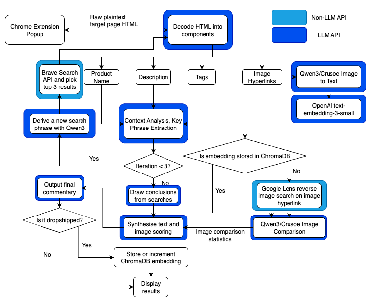

<h1>      DROPSHIT ✅</h1>


Let's begin by setting scene. It's your partner's birthday next week and you're a CS student, dirt poor ~~and probably homeless too~~. But good news! You want to buy your partner a present off of Amazon, costs a decent sum of money but hey, looks cool in the thumbnail! But then your **worst nightmare** appears...


It's a **DROPSHIPPER**. They lurk behind the thick walls of Shopify and Facebook Marketplace, placing their bait and waiting for you to bite at your lowest. They make a margin of 10x and you get a gift that won't last longer than 2 days. Now, we want to ask you, is that really fair?

## What we solve for you
We want to eradicate dropshippers. Sure, it's a nice stream of money for them, but as consumers, we want to make sure that when we pay premiums, we get what we pay for. 

Our tool will detect dropshipper listings, match against our database of most commonly dropshipped products, and provide you for an opportunity not to bite their bait and spend your money elsewhere. 

# Developer guide

## API Keys
Make sure to set values for your dotenv file. Run:

```bash
cp .env.example .env
```

And then fill in the blanks with your keys for each.

## Running the Extension

You must run the proxy and then start the extension.

Install Python and uv. Then,

```bash
uv sync
. .venv/bin/activate
uv run backend/proxy.py
```

To start the extension, navigate to `chrome://extensions/` in Chrome. Then, toggle 'developer mode', select 'load unpacked', and drag and drop `dropshit/extension`.

## Data Flow Diagram



## Claude & Docs

We fairly concisely sum up how to navigate the repository in the `CLAUDE.md`. This works well with Claude Code as we have **very** thoroughly tried.
