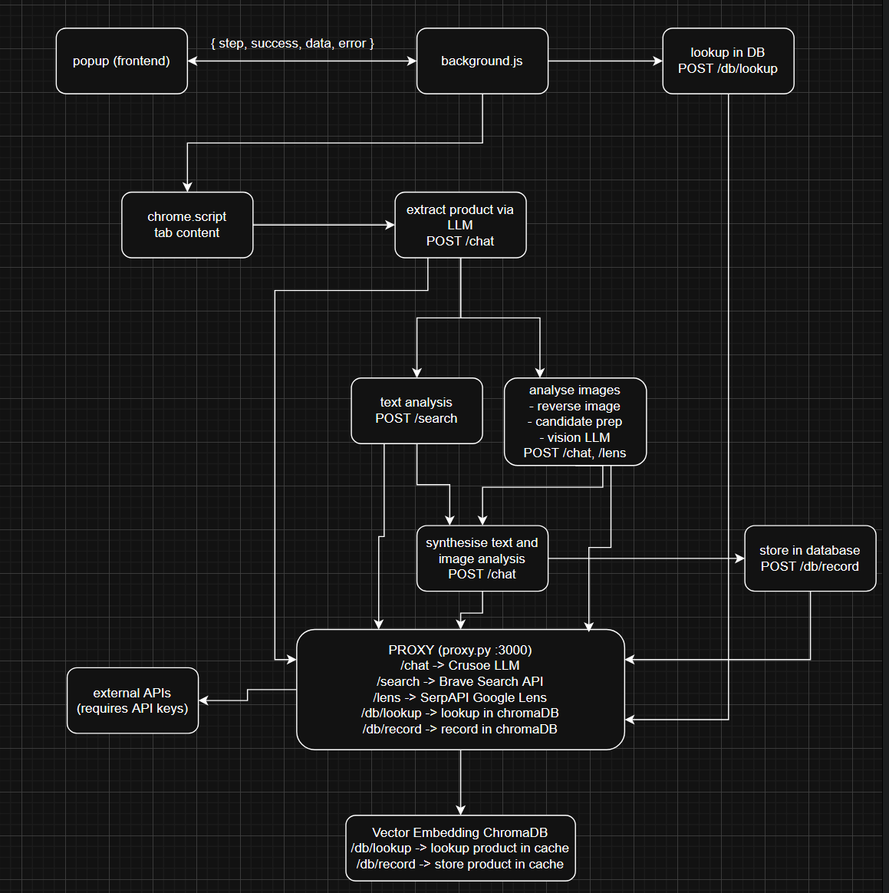

# Dropshit

## API Keys
Make sure to set values for your dotenv file. Run:

```bash
cp .env.example .env
```

And then fill in the blanks with your keys.

## Running the Extension

You must run the proxy and then start the extension.

Install Python and uv. Then,

```bash
uv sync
. .venv/bin/activate
python backend/proxy.py
```

To start the extension, navigate to `chrome://extensions/` in Chrome. Then, toggle 'developer mode', select 'load unpacked', and load `dropshit/extension`.

## Data Flow Diagram


